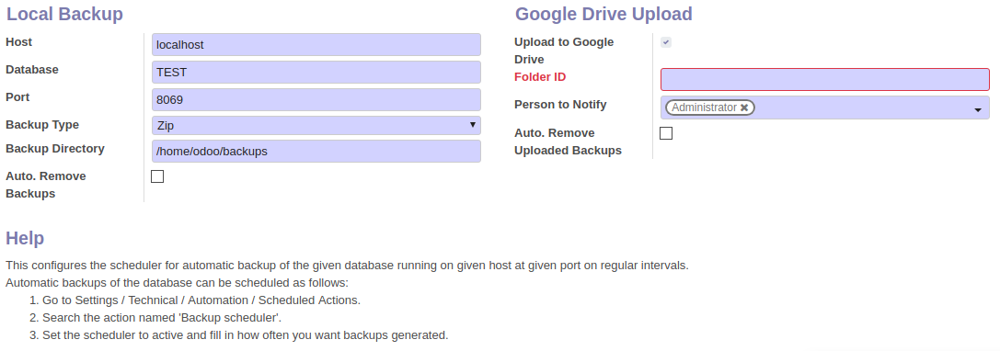
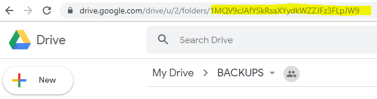
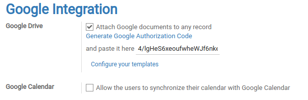
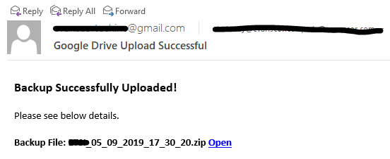
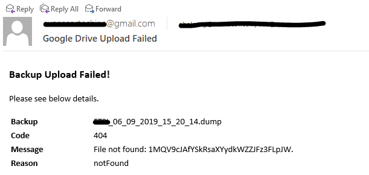

Database Auto-Backup Upload
===========================

This module is provided by :
 - Pablo Adarfio - *Tecno-Go*
 - Aurel Balanay - *Evanscor Technology Solutions Inc*

**Source**: https://apps.odoo.com/apps/modules/13.0/backup_upload_google_drive/
 

Improvements by [Myrrkel](https://github.com/myrrkel):
 - add README.md
 - Add email_google_drive_upload template in xml data.
 - Fix auto_backup_upload useless dependency.

### Automatically Upload of Backups to Google Drive

This module is for uploading of backups to google drive. The local backup capability of this module is derived from the auto_backup module by Yenthe Van Ginneken**

### Instructions

**Developer Mode:** Settings > Technical > Backup > Configure Backups

 - Configure local backup (For steps: Please refer to auto_backup module of Yenthe Van Ginneken)
   
 - Configure Google Drive Upload
   
    - Tick Upload to Google Drive
    - Fill Folder Id (Second Image will show where to find Drive Folder ID)
    - Email Notification: Select users to receive email notification for successful and failed upload
    - Tick Auto Remove: If you want to auto remove uploaded back-ups to google drive
    - Uploaded Back-ups remove after x days: Retention period

 - To get the Google Drive Folder ID
   
     - Go to your Google Drive Account
     - Create New Folder
     - Please see image for the Folder ID

 - Google Integration

    - Go to Settings > General Setting > Google Integration
    - Check Attached google documents to any record
    - Generate Google Authorization code
    - Paste code to the field provided

### Automatic sending of email notifications

